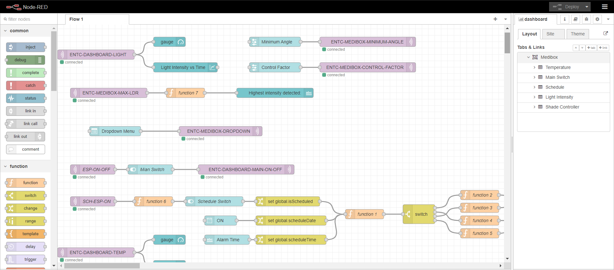
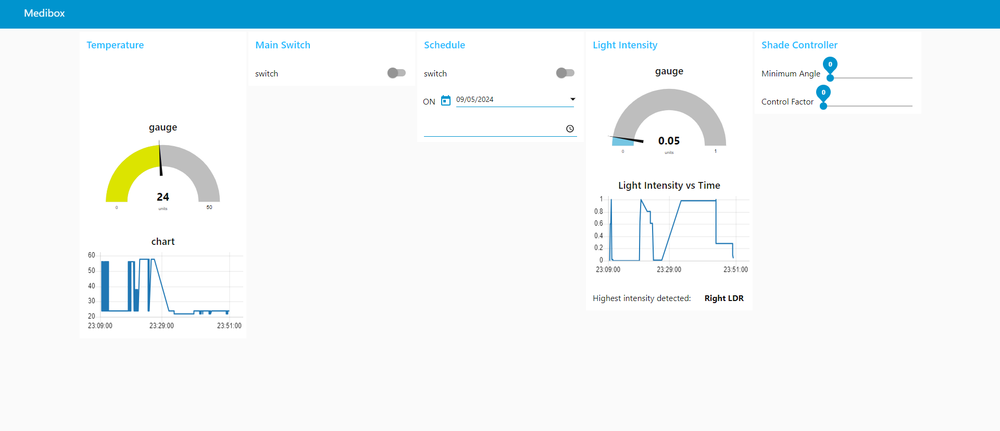
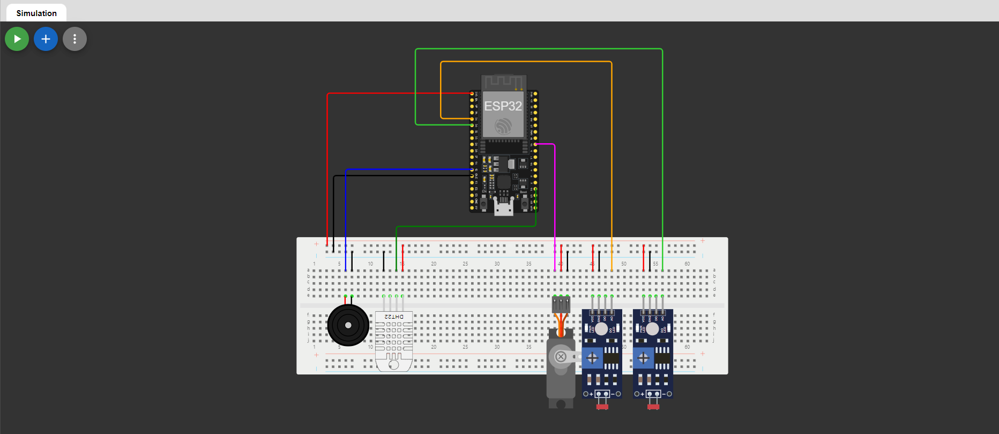

# Smart Medibox Project

This project demonstrates a **Smart Medibox** system, developed as part of an Embedded Systems and Applications module. The system is designed to assist users in managing their medication, monitoring environmental conditions, and providing notifications at scheduled times.

## Project Overview

The Smart Medibox uses an ESP32 microcontroller to control various components, such as temperature and humidity sensors, a buzzer for alarms, and a servo motor to control a shaded sliding window based on light intensity and medicine selection.

### Problem Statement

Different medicines have different requirements for the minimum angle and controlling factors to adjust the position of the shaded sliding window. This system enables users to:

- Adjust the **minimum angle** and **controlling factor** through sliders on a Node-RED dashboard.
- Choose from predefined medicine options or a custom mode where they can manually configure the values.
  
#### Key Features:
- **Medicine Selection**: Dropdown menu to select predefined medicines (Tablet A, B, C) or a custom option.
- **Angle Adjustment**: Slider controls to modify the shaded window's angle based on light intensity.
- **Alarm System**: Notifications and scheduled alarms for taking medication.
- **Environmental Monitoring**: Displays real-time temperature and humidity data.

## Node-RED Flow Diagram

Below is the flow diagram of the Node-RED dashboard and MQTT communication:

The flow consists of:
- **Temperature and Humidity Monitoring**: Continuous reading and display on the dashboard.
- **Servo Motor Control**: Adjustments to the shaded window position based on the light intensity and selected medicine.
- **Scheduled Alarms**: Notification system using MQTT to trigger alarms at predefined times.

## Node-RED Dashboard

The following image shows the layout of the Node-RED dashboard:

### Dashboard Components:
- **Medicine Selection Dropdown**: Users can select a medicine type, or opt for a custom mode to manually adjust settings.
- **Angle and Control Factor Sliders**: These sliders adjust the window angle and control factor based on the user’s input.
- **Temperature and Humidity Display**: Real-time environmental monitoring.
- **Alarm Settings**: Configure scheduled alarms for medication reminders.

## Circuit Diagram

The following circuit diagram shows the connections of the ESP32, DHT sensor, LDRs, and the servo motor:

### Circuit Components:
- **ESP32**: Microcontroller that acts as the brain of the system.
- **DHT Sensor**: Measures temperature and humidity inside the Medibox.
- **LDR Sensors**: Measures light intensity on both sides of the box.
- **Servo Motor**: Adjusts the sliding window’s angle based on the LDR readings.
- **Buzzer**: Provides audible notifications for alarms.

## How to Use the System

1. **Connect the Components**: Follow the circuit diagram to connect the ESP32 with the DHT sensor, LDRs, servo motor, and buzzer.
2. **Deploy the Node-RED Dashboard**: Import the Node-RED flow and set up the MQTT communication.
3. **Monitor Temperature and Humidity**: View real-time temperature and humidity data on the dashboard.
4. **Control the Window Angle**: Use the sliders to manually adjust the angle or select a predefined medicine for automatic control.
5. **Set Alarms**: Schedule medication reminders using the alarm feature.

## Future Improvements

- Implement real-time data logging for long-term tracking of environmental conditions.
- Add more customizable options for medicine-specific configurations.
- Introduce a web-based interface for remote control and monitoring.

